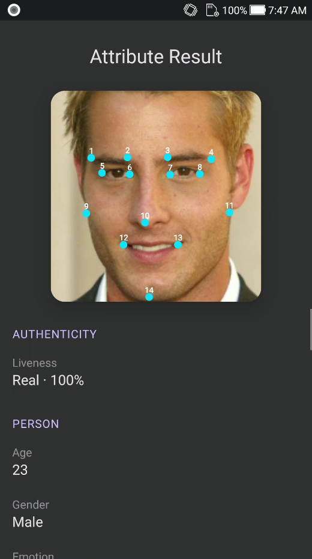

<div align="center">

</div>

#### 🌐 Company Site - [Here](https://faceplugin.com)
#### 🤗 Hugging Face - [Here](https://huggingface.co/FacePlugin-Ltd)
#### 🛟 Help Center - [Here](https://doc.faceplugin.com)
#### 🐳 Docker Hub - [Here](https://hub.docker.com/u/faceplugin)

# FacePlugin Face Recognition SDK — Fully On-Premise

> **NIST FRVT**-class **face recognition SDK** with **3D passive liveness detection**. Face detection, landmarks, quality, 1:1 / 1:N match — on your device, with **no** data leaving the device.
> Jump: [Try it](#try-it) · [Screenshots](#screenshots) · [Platforms](#choose-your-platform) · [Products](#list-of-our-products) · [Contact](#contact)

## Overview

FacePlugin **Face Recognition SDK** is a fully **on-premise face recognition SDK** for KYC, access control, and identity verification. It is paired with an **iBeta Level 2** class **liveness detection SDK** that safeguards against **printed photos, video replay, 3D masks, and deepfake threats**.

You get **face detection** (box, landmarks, pose, attributes), **ICAO-style face quality**, **template extraction**, **1:1 match**, and **1:N identify** — on the phone or on your server.

All processing stays on the device. **NO** biometric data is sent to FacePlugin cloud.

Docs: [https://doc.faceplugin.com](https://doc.faceplugin.com)

Dedicated PAD-only product: **[Face Liveness Detection SDK](https://github.com/Faceplugin-ltd/Face-Liveness-Detection-SDK)**.

## Try it

### Mobile SDK on Google Play

<a href="https://play.google.com/store/apps/details?id=ai.faceplugin.recognition" target="_blank">
  
</a>

### Server SDK on Playground & Hugging Face

- [FacePlugin Playground](https://playground.faceplugin.com/)
- [Hugging Face Space](https://huggingface.co/spaces/FacePlugin-Ltd/FaceRecognition-LivenessDetection-SDK)

### Linux / Docker (no Drive)

```bash
docker pull faceplugin/face-recognition:latest
docker run -d --name faceplugin-face-recognition \
  --shm-size=2gb --privileged \
  -p 8083:8083 \
  -v /etc/machine-id:/etc/machine-id:ro \
  faceplugin/face-recognition:latest
curl -s http://127.0.0.1:8083/api/health
```

Then `POST /api/detect`, `/api/quality`, `/api/match`. Guide: [FaceRecognition-Docker](https://github.com/Faceplugin-ltd/FaceRecognition-Docker).

## Screenshots

| Home | Identify | Capture | Attributes |
| ---- | -------- | ------- | ---------- |
| <p align="center"></p> | <p align="center"></p> | <p align="center"></p> | <p align="center"></p> |

## On YouTube

<div align="center">
<a href="https://www.youtube.com/watch?v=qVtdkwtGtqs" target="_blank">
 
</a>
</div>

## Choose your platform

This GitHub repo is the **product hub**. Clone the platform SDK you need. Engine binaries are on Google Drive (too large for GitHub); Docker Hub already includes the runtime.

| Platform | Repository | Fastest path |
| -------- | ---------- | ------------ |
| **Android (Java, Kotlin)** | [FaceRecognition-Android](https://github.com/Faceplugin-ltd/FaceRecognition-Android) | Drop `facerecognitionsdk.aar` → Enroll / Identify |
| **iOS (Objective-C, Swift)** | [FaceRecognition-iOS](https://github.com/Faceplugin-ltd/FaceRecognition-iOS) | Add frameworks → run the sample |
| **Windows** | [FaceRecognition-Windows](https://github.com/Faceplugin-ltd/FaceRecognition-Windows) | Native Windows SDK + demo |
| **Linux / Docker** | [FaceRecognition-Docker](https://github.com/Faceplugin-ltd/FaceRecognition-Docker) | `docker pull faceplugin/face-recognition` |
| **React Native** | [FaceRecognition-React-Native](https://github.com/Faceplugin-ltd/FaceRecognition-React-Native) | Android + iOS sample |
| **Flutter** | [FaceRecognition-Flutter](https://github.com/Faceplugin-ltd/FaceRecognition-Flutter) | Android + iOS plugin + example |
| **Ionic Capacitor** | [FaceRecognition-Ionic-Capacitor](https://github.com/Faceplugin-ltd/FaceRecognition-Ionic-Capacitor) | Capacitor Android / iOS |
| **Ionic Cordova** | [FaceRecognition-Ionic-Cordova](https://github.com/Faceplugin-ltd/FaceRecognition-Ionic-Cordova) | Cordova Android / iOS |
| **.NET MAUI** | [FaceRecognition-.Net](https://github.com/Faceplugin-ltd/FaceRecognition-.Net) | .NET sample |
| **.NET WPF** | [FaceRecognition-WPF-.Net](https://github.com/Faceplugin-ltd/FaceRecognition-WPF-.Net) | WPF desktop |
| **JavaScript** | [FaceRecognition-LivenessDetection-Javascript](https://github.com/Faceplugin-ltd/FaceRecognition-LivenessDetection-Javascript) | Web SDK |
| **React** | [FaceRecognition-LivenessDetection-React](https://github.com/Faceplugin-ltd/FaceRecognition-LivenessDetection-React) | React web |
| **Vue** | [FaceRecognition-LivenessDetection-Vue](https://github.com/Faceplugin-ltd/FaceRecognition-LivenessDetection-Vue) | Vue web |

## List of our Products

**Face Recognition with Liveness Detection**

- [Android (Java, Kotlin)](https://github.com/Faceplugin-ltd/FaceRecognition-Android)
- [iOS (Objective-C, Swift)](https://github.com/Faceplugin-ltd/FaceRecognition-iOS)
- [React Native](https://github.com/Faceplugin-ltd/FaceRecognition-React-Native)
- [Flutter](https://github.com/Faceplugin-ltd/FaceRecognition-Flutter)
- [Ionic Capacitor](https://github.com/Faceplugin-ltd/FaceRecognition-Ionic-Capacitor)
- [Ionic Cordova](https://github.com/Faceplugin-ltd/FaceRecognition-Ionic-Cordova)
- [.NET MAUI](https://github.com/Faceplugin-ltd/FaceRecognition-.Net)
- [.NET WPF](https://github.com/Faceplugin-ltd/FaceRecognition-WPF-.Net)
- [JavaScript](https://github.com/Faceplugin-ltd/FaceRecognition-LivenessDetection-Javascript)
- [React](https://github.com/Faceplugin-ltd/FaceRecognition-LivenessDetection-React)
- [Vue](https://github.com/Faceplugin-ltd/FaceRecognition-LivenessDetection-Vue)
- [Windows](https://github.com/Faceplugin-ltd/FaceRecognition-Windows)
- [Linux / Docker](https://github.com/Faceplugin-ltd/FaceRecognition-Docker)

**Face Liveness Detection SDK**

- [Android (Java, Kotlin)](https://github.com/Faceplugin-ltd/FaceLivenessDetection-Android)
- [iOS (Objective-C, Swift)](https://github.com/Faceplugin-ltd/FaceLivenessDetection-iOS)
- [Windows](https://github.com/Faceplugin-ltd/FaceLivenessDetection-Windows)
- [Linux / Docker](https://github.com/Faceplugin-ltd/FaceLivenessDetection-Docker)
- [Face Liveness Detection SDK (hub)](https://github.com/Faceplugin-ltd/Face-Liveness-Detection-SDK)

**More FacePlugin**

- [Face Recognition SDK (this hub)](https://github.com/Faceplugin-ltd/Face-Recognition-SDK)
- [Open Source Face Recognition SDK](https://github.com/Faceplugin-ltd/Open-Source-Face-Recognition-SDK)
- [Palm Recognition SDK](https://github.com/Faceplugin-ltd/Palm-Recognition)
- [ID Document Recognition SDK](https://github.com/Faceplugin-ltd/ID-Document-Recognition-SDK)
- [ID Document Liveness Detection](https://github.com/Faceplugin-ltd/ID-Document-Liveness-Detection-Docker)

## Contact

<div align="left">
<a target="_blank" href="mailto:info@faceplugin.com"></a>&emsp;
<a target="_blank" href="https://wa.me/+14692784822"></a>
</div>
